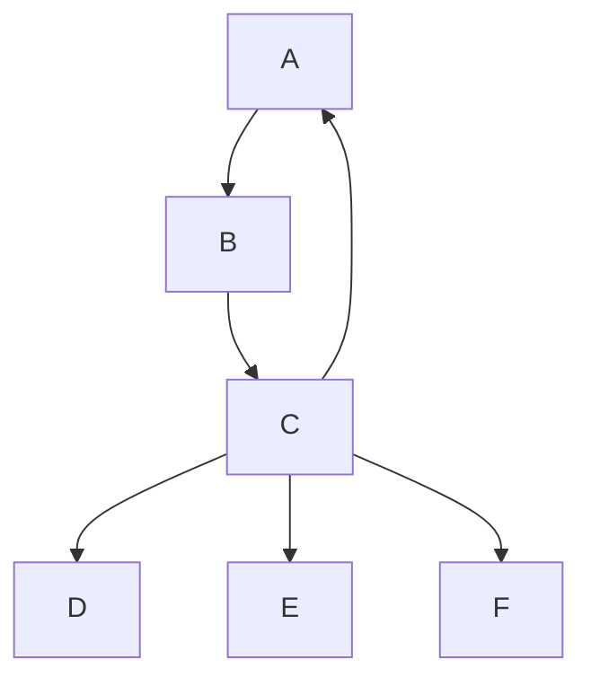

# FLOWCHART

Start with keyword `flowchart`. Each line a statement. Concatenate multiple statements with `;`. Node identifier case-sensitive (forward declaration not necessary). Use `-->` to connect nodes. Use `&` shorthand to connect to multiple nodes.

```text
flowchart
    A --> B
    B --> C; C --> A
    C --> D & E & F
```



`flowchart` interchangeable with `graph`.
