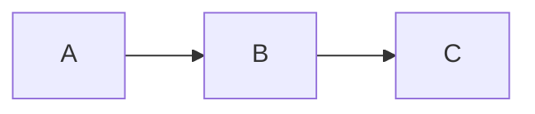

# DIRECTION

Add keyword after `flowchart`:

* `TD` or `TB`: Top-Down or Top-to-Bottom
* `BT`: Bottom-to-Top
* `LR`: Left-to-Right
* `RL`: Right-to-Left

Default is `TD`.

```text
flowchart LR
    A --> B; B --> C
```


