# LINK

Connects nodes. Also called **edge**. Other than unidirectional `-->`, many variations. Can add text. Can chain.

## Text

2 forms. First always applicable, second has exceptions as noted:

```text
flowchart LR
    A -->|Text 1| B
    B -- Text 2 --> C
```

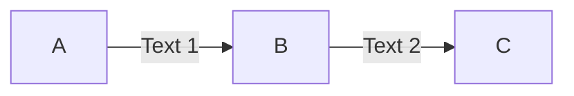

## Open Link

```text
flowchart LR
    A --- B
    C -.- D
    E === F
```

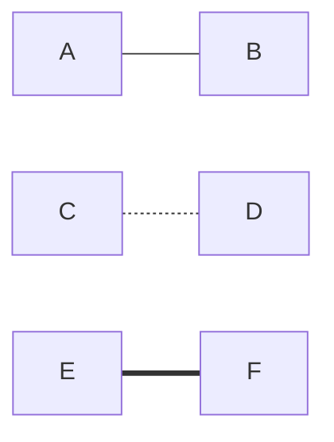

## Dotted Link

```text
flowchart LR
    A -.-> B
    B -. Text .-> C
```

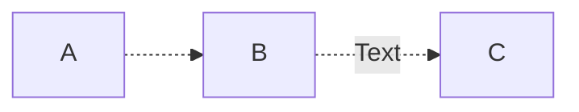

## Thick Link

```text
flowchart LR
    A ==> B
```

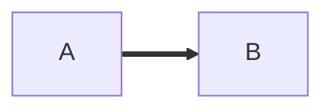

## Invisible Link

Useful to alter default node positioning.

```text
flowchart LR
    A ~~~ B
```

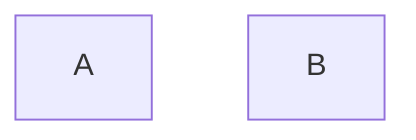

## Chaining

```text
flowchart LR
    A --> B & C --> D
```

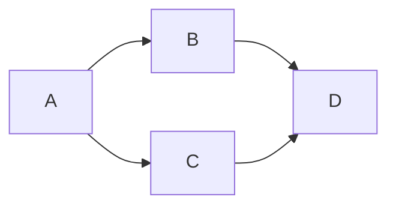

```text
flowchart
    A & B --> C & D
```

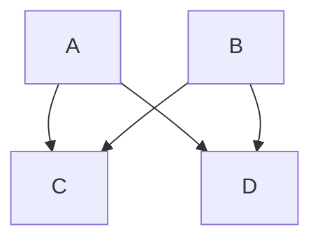

## ID

Can assign ID to link, for more advanced styling, classes, animation.

```text
flowchart LR
    A e1@--> B
```


## Animation

```text
flowchart LR
    A e1@==> B
    e1@{ animate: true }
```

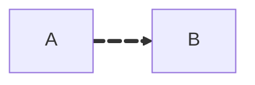

### Speed

Can specify `slow` or `fast`.

```text
flowchart LR
    A e1@==> B
    e1@{ animation: slow }
```

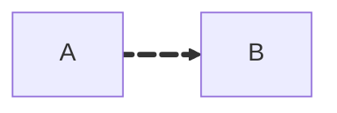

Enables animation by default.

### Using `classDef`

For customization and finetuning.

```text
flowchart LR
    A e1@--> B
    classDef animate stroke-dasharray: 10, 5, stroke-dashoffset: 1000, animation: dash 8s ease-in-out infinite;
    class e1 animate
```

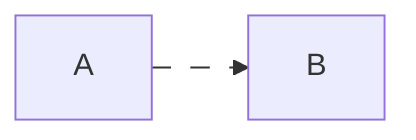

## Arrow

Can also be *circle* or *cross*. Can be bidirectional.

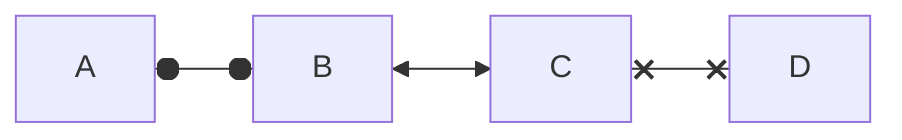

## Length

Each node is assigned a *rank* (vertical or horizontal level) in rendered graph, based on linked nodes. By default, links can span any number of ranks, but can explicitly make link longer by adding extra dashes.

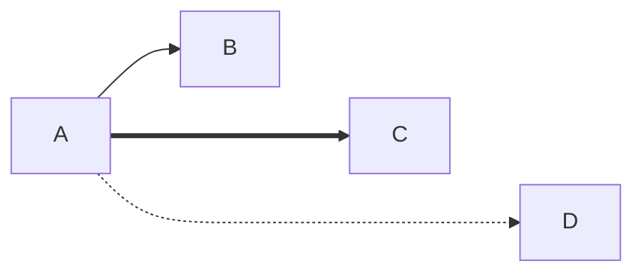
