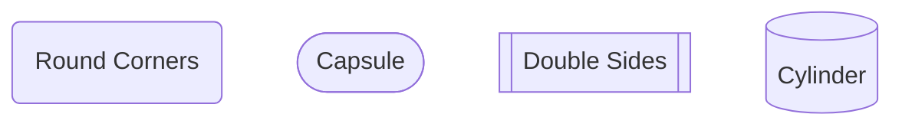
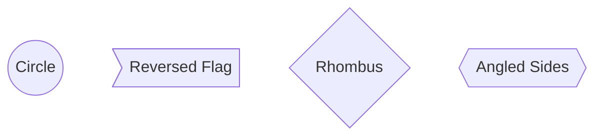
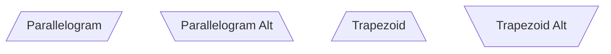
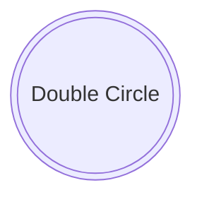
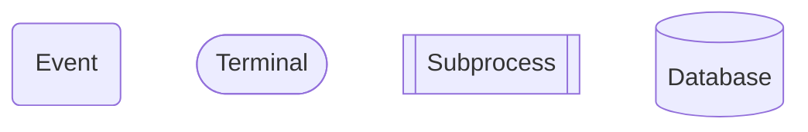
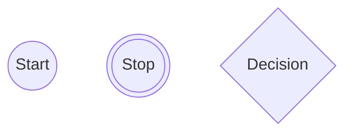
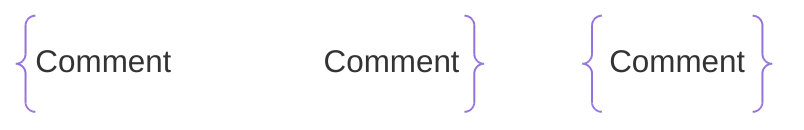
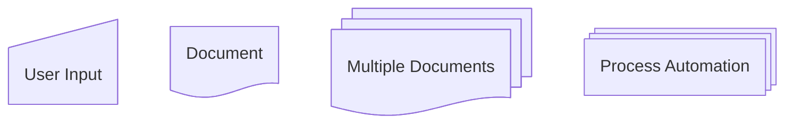

# NODE SHAPE

<https://mermaid.ai/open-source/syntax/flowchart.html#node-shapes>

Many available.

```text
flowchart
    id1(Round Corners)
    id2([Capsule])
    id3[[Double Sides]]
    id4[(Cylinder)]
```



```text
flowchart
    id1((Circle))
    id2>Reversed Flag]
    id3{Rhombus}
    id4{{Angled Sides}}
```



```text
flowchart
    id1[/Parallelogram/]
    id2[\Parallelogram Alt\]
    id3[/Trapezoid\]
    id4[\Trapezoid Alt/]
```



```text
flowchart
    id5(((Double Circle)))
```



## General Syntax

To support growing number of shapes. Some examples shown; see documentation for full list.

```text
graph
    A@{ shape: rounded, label: "Event" }
    B@{ shape: stadium, label: "Terminal" }
    C@{ shape: fr-rect, label: "Subprocess" }
    D@{ shape: cyl, label: "Database" }
```



```text
graph
    A@{ shape: circle, label: "Start" }
    B@{ shape: dbl-circ, label: "Stop" }
    C@{ shape: diamond, label: "Decision" }
```



```text
graph
    A@{ shape: brace, label: "Comment" }
    B@{ shape: brace-r, label: "Comment" }
    C@{ shape: braces, label: "Comment" }
```



```text
graph
    A@{ shape: manual-input, label: "User Input" }
    B@{ shape: doc, label: "Document" }
    C@{ shape: docs, label: "Multiple Documents" }
    D@{ shape: procs, label: "Process Automation" }
```


