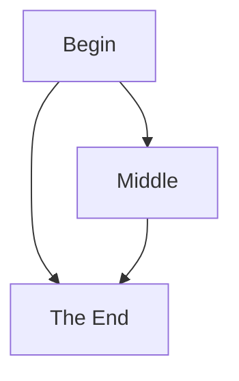
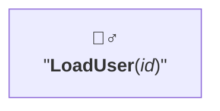

# NODE TEXT

Set with `[]`. Can forward-declare for clarity.

```text
flowchart
    A[Begin]; B[Middle]; C[The End]
    A --> B & C
    B --> C
```



Multi-line acceptable. Some special characters can only be displayed if text enclosed in double quotes. Can embed HTML entities. To embed Markdown, enclose with `` ` ``.

```text
graph
    A["`🙎‍♂️
    &quot;**LoadUser**(_id_)&quot;`"]
```


