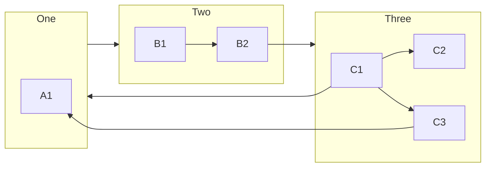
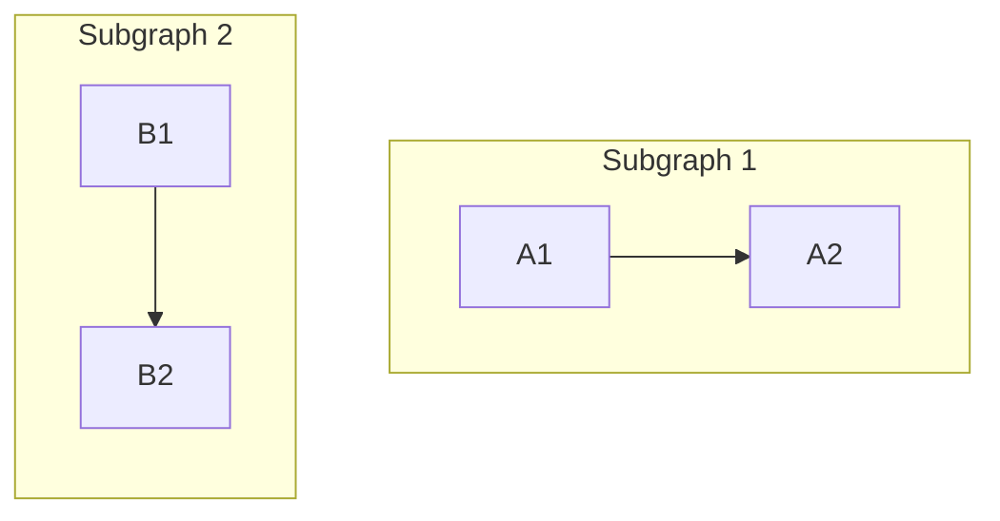
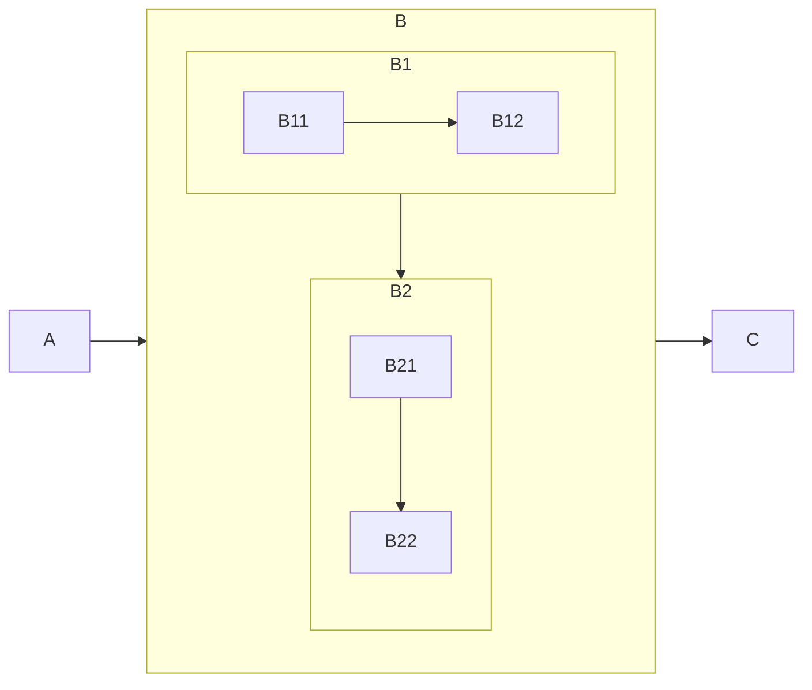

# SUBGRAPH

Each subgraph defined with `subgraph`. Just like node, can have label and identified by ID. Subgraphs and nodes can inter-link (outside subgraph definitions).

```text
graph LR
    subgraph A[One]
        A1
    end

    subgraph B[Two]
        B1 --> B2
    end

    subgraph C[Three]
        C1 --> C2 & C3
    end

    A --> B
    B2 --> C
    C1 --> A
    C3 --> A1
```



## Direction

Specified with `direction`.

```text
graph
    subgraph S1[Subgraph 1]
        A1 --> A2
    end

    subgraph S2[Subgraph 2]
        direction TB
        B1 --> B2
    end
```



Ignored if any node links to outside; inherits parent's direction instead.

## Nested

```text
graph LR
    A
    subgraph B
        subgraph B1
            B11 --> B12
        end
        subgraph B2
            direction TB
            B21 --> B22
        end
    end
    C

    A --> B
    B1 --> B2
    B --> C
```


